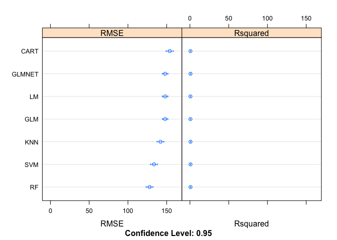

R Notebook
================

Initial Model Fit; without date feature
=======================================

Load necessary package and data from file

``` r
library(caret)
```

    ## Loading required package: lattice

    ## Loading required package: ggplot2

``` r
source("millstyleBreakdown.R")

# Data contains NAs generated from merging tables
data <- na.omit(millstyleBreakdown())
```

    ## 
    ## Attaching package: 'dplyr'

    ## The following objects are masked from 'package:stats':
    ## 
    ##     filter, lag

    ## The following objects are masked from 'package:base':
    ## 
    ##     intersect, setdiff, setequal, union

    ## 
    ## Attaching package: 'lubridate'

    ## The following object is masked from 'package:base':
    ## 
    ##     date

    ## Loading required package: gsubfn

    ## Loading required package: proto

    ## Loading required package: RSQLite

    ## # A tibble: 24,518 x 7
    ##    range   millstyle order    duedate       date   yds  loom
    ##    <chr>       <chr> <int>     <date>     <date> <dbl> <int>
    ##  1   738 738-22554-1 40738 2015-08-07 2015-07-15  40.0     1
    ##  2   738 738-23306-1 40738 2015-08-28 2015-07-16  32.1     1
    ##  3   738 738-23306-1 40738 2015-08-28 2015-07-16  32.1     1
    ##  4   738 738-23306-1 40738 2015-08-28 2015-07-17  31.0     1
    ##  5   738 738-23306-1 40738 2015-08-28 2015-07-17  31.0     1
    ##  6   738 738-23306-1 40738 2015-08-28 2015-07-20  32.0     1
    ##  7   738 738-23306-1 40738 2015-08-28 2015-07-20  32.0     1
    ##  8   738 738-23306-1 40738 2015-08-28 2015-07-20  30.5     1
    ##  9   738 738-23306-1 40738 2015-08-28 2015-07-20  30.5     1
    ## 10   738 738-23306-1 40738 2015-08-28 2015-07-20  32.0     1
    ## # ... with 24,508 more rows

``` r
# Removing row identifier (millstyle), and initially date
data <- subset(data, select = -c(millstyle, date))
```

``` r
#Establishes constant seed for consequent use in model development
seed <- 7
set.seed(seed)

# Partitions data to create training, validation, and testing sets for model comparison;
# Data is split 60/20/20 training, validation, testing
inVal <- createDataPartition(data$totalstops,
                             p = .6,
                             list = FALSE)
val_test <- data[-inVal,]
training <- data[inVal,]

inTrain <- createDataPartition(val_test$totalstops, 
                               p = .5,
                               list = FALSE)
validation <- val_test[inTrain,]
testing <- val_test[-inTrain,]
        
        
# Set training control parameters for repeated cross validation and evaluation metric
trainControl <- trainControl(method = "repeatedCV",
                             number = 10,
                             repeats = 3,
                             allowParallel = TRUE)
metric <- "RMSE"


# Prepares Workbook for Parallel Processing
library(parallel)
library(doParallel)
```

    ## Loading required package: foreach

    ## Loading required package: iterators

``` r
cluster <- makeCluster(detectCores()-1)
```

Baseline Model Fit: No PreProcessing of Data
--------------------------------------------

``` r
# Prepares Workbook for Parallel Processing
library(parallel)
library(doParallel)
cluster <- makeCluster(detectCores()-1)
registerDoParallel(cluster)

#Linear Model
set.seed(seed)
fit.lm <- train(totalstops~.,
                data = training,
                method = "lm",
                metric = metric,
                trControl = trainControl)
```

    ## Warning: closing unused connection 7 (<-localhost:11060)

    ## Warning: closing unused connection 6 (<-localhost:11060)

    ## Warning: closing unused connection 5 (<-localhost:11060)

``` r
#Generalized Linear Model
set.seed(seed)
fit.glm <- train(totalstops~.,
                 data = training,
                 method = "glm",
                 metric = metric,
                 trControl = trainControl)

#GLMNET
set.seed(seed)
fit.glmnet <- train(totalstops~.,
                    data = training,
                    method = "glmnet",
                    metric = metric,
                    trControl = trainControl)
```

    ## Loading required package: glmnet

    ## Loading required package: Matrix

    ## Loaded glmnet 2.0-12

``` r
# SVM
set.seed(seed)
fit.svm <- train(totalstops~.,
                 data = training,
                 method = "svmRadial",
                 metric = metric,
                 trControl = trainControl)
```

    ## Loading required package: kernlab

    ## 
    ## Attaching package: 'kernlab'

    ## The following object is masked from 'package:ggplot2':
    ## 
    ##     alpha

``` r
# CART
set.seed(seed)
grid <- expand.grid(.cp=c(0, 0.05, 0.1))
fit.cart <- train(totalstops~.,
                  data = training,
                  method = "rpart",
                  metric = metric,
                  tuneGrid=grid,
                  trControl = trainControl)
```

    ## Loading required package: rpart

``` r
# KNN
set.seed(seed)
fit.knn <- train(totalstops~.,
                 data = training,
                 method = "knn",
                 metric = metric,
                 trControl = trainControl)

# Random Forest
set.seed(seed)
fit.rf <- train(totalstops~.,
                data = training,
                method = "rf",
                metric = metric,
                trControl = trainControl)
```

    ## Loading required package: randomForest

    ## randomForest 4.6-12

    ## Type rfNews() to see new features/changes/bug fixes.

    ## 
    ## Attaching package: 'randomForest'

    ## The following object is masked from 'package:dplyr':
    ## 
    ##     combine

    ## The following object is masked from 'package:ggplot2':
    ## 
    ##     margin

``` r
# Results
fit.results <- resamples(list(LM=fit.lm, 
                          GLM=fit.glm, 
                          GLMNET=fit.glmnet, 
                          SVM=fit.svm,
                          CART=fit.cart, 
                          KNN=fit.knn,
                          RF=fit.rf))

# Stops Parallel Processing
stopCluster(cluster)
registerDoSEQ()
```

### Baseline Model Fit results

``` r
summary(fit.results)
```

    ## 
    ## Call:
    ## summary.resamples(object = fit.results)
    ## 
    ## Models: LM, GLM, GLMNET, SVM, CART, KNN, RF 
    ## Number of resamples: 30 
    ## 
    ## RMSE 
    ##            Min.  1st Qu.   Median     Mean  3rd Qu.     Max. NA's
    ## LM     125.5309 140.6084 148.6883 147.9922 153.6351 170.9438    0
    ## GLM    125.5309 140.6084 148.6883 147.9922 153.6351 170.9438    0
    ## GLMNET 125.2348 140.7281 148.6195 148.0172 154.0821 171.0306    0
    ## SVM    115.7399 124.8177 132.0191 133.6644 141.9676 156.5147    0
    ## CART   131.0901 146.2327 153.3304 153.8990 161.9389 179.2490    0
    ## KNN    144.8278 160.6679 170.6381 169.9295 176.6658 201.9486    0
    ## RF     105.2383 118.6247 129.7462 127.8077 135.9320 148.8981    0
    ## 
    ## Rsquared 
    ##             Min.   1st Qu.    Median      Mean   3rd Qu.      Max. NA's
    ## LM     0.6110471 0.6319206 0.6599743 0.6610961 0.6851835 0.7172394    0
    ## GLM    0.6110471 0.6319206 0.6599743 0.6610961 0.6851835 0.7172394    0
    ## GLMNET 0.6143831 0.6336415 0.6605856 0.6610072 0.6856270 0.7160576    0
    ## SVM    0.6577380 0.7139257 0.7373133 0.7365230 0.7574276 0.8039670    0
    ## CART   0.5054018 0.6279583 0.6388162 0.6446451 0.6743183 0.7356594    0
    ## KNN    0.4383869 0.5312175 0.5571834 0.5552875 0.5850841 0.6343420    0
    ## RF     0.6694018 0.7152963 0.7481962 0.7477273 0.7743534 0.8275921    0

### Baseline Model Fit results plot

``` r
dotplot(fit.results)
```


### Baseline Model Fit Timings

``` r
fit.results$timings
```

    ##        Everything FinalModel Prediction
    ## LM          7.911      0.072         NA
    ## GLM         2.947      0.091         NA
    ## GLMNET      4.565      0.242         NA
    ## SVM        71.564      2.344         NA
    ## CART        3.382      0.096         NA
    ## KNN         5.491      0.017         NA
    ## RF        924.594     22.799         NA

Preprocessed Model Fit: Standardized
------------------------------------

``` r
# Initializes Parallel Processing
cluster <- makeCluster(detectCores()-1)
registerDoParallel(cluster)

#Linear Model

set.seed(seed)
standardized.lm <- train(totalstops~.,
                data = training,
                method = "lm",
                metric = metric,
                preProc=c("center", "scale"),
                trControl = trainControl)


#Generalized Linear Model
set.seed(seed)
standardized.glm <- train(totalstops~.,
                 data = training,
                 method = "glm",
                 metric = metric,
                 preProc=c("center", "scale"),
                 trControl = trainControl)

#GLMNET
set.seed(seed)
standardized.glmnet <- train(totalstops~.,
                    data = training,
                    method = "glmnet",
                    metric = metric,
                    preProc=c("center", "scale"),
                    trControl = trainControl)

# SVM
set.seed(seed)
standardized.svm <- train(totalstops~.,
                 data = training,
                 method = "svmRadial",
                 metric = metric,
                 preProc=c("center", "scale"),
                 trControl = trainControl)

# CART
set.seed(seed)
grid <- expand.grid(.cp=c(0, 0.05, 0.1))
standardized.cart <- train(totalstops~.,
                  data = training,
                  method = "rpart",
                  metric = metric,
                  preProc=c("center", "scale"),
                  tuneGrid=grid,
                  trControl = trainControl)
        

# KNN
set.seed(seed)
standardized.knn <- train(totalstops~.,
                 data = training,
                 method = "knn",
                 metric = metric,
                 preProc=c("center", "scale"),
                 trControl = trainControl)

# Random Forest
set.seed(seed)
standardized.rf <- train(totalstops~.,
                data = training,
                method = "rf",
                metric = metric,
                preProc=c("center", "scale"),
                trControl = trainControl)

 
# Results
standardized.results <- resamples(list(LM=standardized.lm, 
                                  GLM=standardized.glm, 
                                  GLMNET=standardized.glmnet, 
                                  SVM=standardized.svm,
                                  CART=standardized.cart, 
                                  KNN=standardized.knn,
                                  RF=standardized.rf))

#Stops Parallel Processing
stopCluster(cluster)
registerDoSEQ()
```

### Standardized Model Fit results

``` r
summary(standardized.results)
```

    ## 
    ## Call:
    ## summary.resamples(object = standardized.results)
    ## 
    ## Models: LM, GLM, GLMNET, SVM, CART, KNN, RF 
    ## Number of resamples: 30 
    ## 
    ## RMSE 
    ##            Min.  1st Qu.   Median     Mean  3rd Qu.     Max. NA's
    ## LM     125.5309 140.6084 148.6883 147.9922 153.6351 170.9438    0
    ## GLM    125.5309 140.6084 148.6883 147.9922 153.6351 170.9438    0
    ## GLMNET 125.2348 140.7281 148.6195 148.0172 154.0821 171.0306    0
    ## SVM    115.7399 124.8177 132.0191 133.6644 141.9676 156.5147    0
    ## CART   131.1628 146.2195 153.3367 153.9201 161.9389 179.2315    0
    ## KNN    121.6579 132.2285 141.1640 141.9594 152.5131 160.7520    0
    ## RF     105.7728 117.8049 130.1364 127.9157 135.9449 148.8424    0
    ## 
    ## Rsquared 
    ##             Min.   1st Qu.    Median      Mean   3rd Qu.      Max. NA's
    ## LM     0.6110471 0.6319206 0.6599743 0.6610961 0.6851835 0.7172394    0
    ## GLM    0.6110471 0.6319206 0.6599743 0.6610961 0.6851835 0.7172394    0
    ## GLMNET 0.6143831 0.6336415 0.6605856 0.6610072 0.6856270 0.7160576    0
    ## SVM    0.6577380 0.7139257 0.7373133 0.7365230 0.7574276 0.8039670    0
    ## CART   0.5055784 0.6258928 0.6388162 0.6446017 0.6743513 0.7346892    0
    ## KNN    0.5946838 0.6636535 0.6910064 0.6915956 0.7356482 0.7631084    0
    ## RF     0.6708125 0.7138710 0.7487710 0.7474515 0.7744525 0.8304075    0

### Standardized Model Fit results plot

``` r
dotplot(standardized.results)
```

 \#\#\# Standardized Model Fit Timings

``` r
standardized.results$timings
```

    ##        Everything FinalModel Prediction
    ## LM          8.617      0.068         NA
    ## GLM         4.556      0.949         NA
    ## GLMNET      7.383      0.050         NA
    ## SVM        69.863      3.002         NA
    ## CART        4.394      0.150         NA
    ## KNN         8.275      0.054         NA
    ## RF        938.714     22.549         NA

Preprocessed Model Fit: YeoJohnson
----------------------------------

``` r
# Prepares Workbook for Parallel Processing and Initializes
library(parallel)
library(doParallel)
cluster <- makeCluster(detectCores()-1)
registerDoParallel(cluster)

#Linear Model

set.seed(seed)
yeojohnson.lm <- train(totalstops~.,
                data = training,
                method = "lm",
                metric = metric,
                preProc=c("YeoJohnson"),
                trControl = trainControl)


#Generalized Linear Model
set.seed(seed)
yeojohnson.glm <- train(totalstops~.,
                 data = training,
                 method = "glm",
                 metric = metric,
                 preProc=c("YeoJohnson"),
                 trControl = trainControl)

#GLMNET
set.seed(seed)
yeojohnson.glmnet <- train(totalstops~.,
                    data = training,
                    method = "glmnet",
                    metric = metric,
                    preProc=c("YeoJohnson"),
                    trControl = trainControl)

# SVM
set.seed(seed)
yeojohnson.svm <- train(totalstops~.,
                 data = training,
                 method = "svmRadial",
                 metric = metric,
                 preProc=c("YeoJohnson"),
                 trControl = trainControl)

# CART
set.seed(seed)
grid <- expand.grid(.cp=c(0, 0.05, 0.1))
yeojohnson.cart <- train(totalstops~.,
                  data = training,
                  method = "rpart",
                  metric = metric,
                  preProc=c("YeoJohnson"),
                  tuneGrid=grid,
                  trControl = trainControl)
        

# KNN
set.seed(seed)
yeojohnson.knn <- train(totalstops~.,
                 data = training,
                 method = "knn",
                 metric = metric,
                 preProc=c("YeoJohnson"),
                 trControl = trainControl)

# Random Forest
set.seed(seed)
yeojohnson.rf <- train(totalstops~.,
                data = training,
                method = "rf",
                metric = metric,
                preProc=c("YeoJohnson"),
                trControl = trainControl)

 
# Results
yeojohnson.results <- resamples(list(LM=yeojohnson.lm, 
                                  GLM=yeojohnson.glm, 
                                  GLMNET=yeojohnson.glmnet, 
                                  SVM=yeojohnson.svm,
                                  CART=yeojohnson.cart, 
                                  KNN=yeojohnson.knn,
                                  RF=yeojohnson.rf))

stopCluster(cluster)
registerDoSEQ()
```

### YeoJohnson Model Fit results

``` r
summary(yeojohnson.results)
```

    ## 
    ## Call:
    ## summary.resamples(object = yeojohnson.results)
    ## 
    ## Models: LM, GLM, GLMNET, SVM, CART, KNN, RF 
    ## Number of resamples: 30 
    ## 
    ## RMSE 
    ##            Min.  1st Qu.   Median     Mean  3rd Qu.     Max. NA's
    ## LM     140.7375 149.5135 157.2971 157.8999 165.1492 183.2053    0
    ## GLM    140.7375 149.5135 157.2971 157.8999 165.1492 183.2053    0
    ## GLMNET 139.8279 149.7366 157.6460 157.7891 165.3431 183.8398    0
    ## SVM    117.9077 130.8226 138.4815 138.5577 147.7584 166.0722    0
    ## CART   130.3121 146.2098 153.3766 153.7636 161.6824 178.2020    0
    ## KNN    121.2476 137.9569 146.9910 147.5878 156.9560 182.5486    0
    ## RF     106.2521 118.1271 128.9267 127.7831 135.6810 149.5346    0
    ## 
    ## Rsquared 
    ##             Min.   1st Qu.    Median      Mean   3rd Qu.      Max. NA's
    ## LM     0.5658442 0.6004199 0.6164816 0.6134269 0.6285676 0.6526540    0
    ## GLM    0.5658442 0.6004199 0.6164816 0.6134269 0.6285676 0.6526540    0
    ## GLMNET 0.5664370 0.6021031 0.6142761 0.6139475 0.6310602 0.6512036    0
    ## SVM    0.6685532 0.7019135 0.7264130 0.7244224 0.7465741 0.7911332    0
    ## CART   0.5119786 0.6233771 0.6423395 0.6452727 0.6743024 0.7355796    0
    ## KNN    0.4795315 0.6271276 0.6708816 0.6630677 0.6909744 0.7669923    0
    ## RF     0.6710407 0.7135906 0.7490334 0.7480496 0.7761917 0.8290681    0

### YeoJohnson Model Fit results plot

``` r
dotplot(yeojohnson.results)
```


### YeoJohnson Model Fit Timings

``` r
yeojohnson.results$timings
```

    ##        Everything FinalModel Prediction
    ## LM         20.672      0.823         NA
    ## GLM        15.049      0.813         NA
    ## GLMNET     38.936      0.944         NA
    ## SVM        98.464      2.045         NA
    ## CART       15.657      0.676         NA
    ## KNN        37.096      0.662         NA
    ## RF        944.272     24.249         NA

PreProcessed Model Fit: Standardized and YeoJohnson Transformation
------------------------------------------------------------------

``` r
# Initializes Parallel Processing
cluster <- makeCluster(detectCores()-1)
registerDoParallel(cluster)

#Linear Model
set.seed(seed)
preProc.lm <- train(totalstops~.,
                data = training,
                method = "lm",
                metric = metric,
                preProc=c("center", "scale", "YeoJohnson"),
                trControl = trainControl)

#Generalized Linear Model
set.seed(seed)
preProc.glm <- train(totalstops~.,
                 data = training,
                 method = "glm",
                 metric = metric,
                 preProc=c("center", "scale", "YeoJohnson"),
                 trControl = trainControl)

#GLMNET
set.seed(seed)
preProc.glmnet <- train(totalstops~.,
                    data = training,
                    method = "glmnet",
                    metric = metric,
                    preProc=c("center", "scale", "YeoJohnson"),
                    trControl = trainControl)

# SVM
set.seed(seed)
preProc.svm <- train(totalstops~.,
                 data = training,
                 method = "svmRadial",
                 metric = metric,
                 preProc=c("center", "scale", "YeoJohnson"),
                 trControl = trainControl)

# CART
set.seed(seed)
grid <- expand.grid(.cp=c(0, 0.05, 0.1))
preProc.cart <- train(totalstops~.,
                  data = training,
                  method = "rpart",
                  metric = metric,
                  preProc=c("center", "scale", "YeoJohnson"),
                  tuneGrid=grid,
                  trControl = trainControl)
        
# KNN
set.seed(seed)
preProc.knn <- train(totalstops~.,
                 data = training,
                 method = "knn",
                 metric = metric,
                 preProc=c("center", "scale", "YeoJohnson"),
                 trControl = trainControl)

# Random Forest
set.seed(seed)
preProc.rf <- train(totalstops~.,
                data = training,
                method = "rf",
                metric = metric,
                preProc=c("center", "scale", "YeoJohnson"),
                trControl = trainControl)

 
# Results
preProc.results <- resamples(list(LM=preProc.lm, 
                                  GLM=preProc.glm, 
                                  GLMNET=preProc.glmnet, 
                                  SVM=preProc.svm,
                                  CART=preProc.cart, 
                                  KNN=preProc.knn,
                                  RF=preProc.rf))

stopCluster(cluster)
registerDoSEQ()
```

### PreProcessed Model Fit Results

``` r
summary(preProc.results)
```

    ## 
    ## Call:
    ## summary.resamples(object = preProc.results)
    ## 
    ## Models: LM, GLM, GLMNET, SVM, CART, KNN, RF 
    ## Number of resamples: 30 
    ## 
    ## RMSE 
    ##            Min.  1st Qu.   Median     Mean  3rd Qu.     Max. NA's
    ## LM     140.7375 149.5135 157.2971 157.8999 165.1492 183.2053    0
    ## GLM    140.7375 149.5135 157.2971 157.8999 165.1492 183.2053    0
    ## GLMNET 139.8279 149.7366 157.6460 157.7891 165.3431 183.8398    0
    ## SVM    117.9077 130.8226 138.4815 138.5577 147.7584 166.0722    0
    ## CART   130.3121 146.2098 153.3766 153.7650 161.6824 178.2020    0
    ## KNN    122.9091 132.5749 142.1641 143.7351 155.2946 166.9556    0
    ## RF     106.3250 118.0621 129.6070 127.6949 136.5800 148.8575    0
    ## 
    ## Rsquared 
    ##             Min.   1st Qu.    Median      Mean   3rd Qu.      Max. NA's
    ## LM     0.5658442 0.6004199 0.6164816 0.6134269 0.6285676 0.6526540    0
    ## GLM    0.5658442 0.6004199 0.6164816 0.6134269 0.6285676 0.6526540    0
    ## GLMNET 0.5664370 0.6021031 0.6142761 0.6139475 0.6310602 0.6512036    0
    ## SVM    0.6685532 0.7019135 0.7264130 0.7244224 0.7465741 0.7911332    0
    ## CART   0.5119786 0.6233771 0.6423395 0.6452622 0.6743024 0.7355796    0
    ## KNN    0.5795756 0.6519255 0.6912506 0.6817756 0.7191624 0.7495945    0
    ## RF     0.6752222 0.7146431 0.7494072 0.7484265 0.7723742 0.8290681    0

### PreProcessed Model Fit results plot

``` r
dotplot(preProc.results)
```


### PreProcessed Model Fit Timings

``` r
preProc.results$timings
```

    ##        Everything FinalModel Prediction
    ## LM         22.498      0.638         NA
    ## GLM        14.884      0.811         NA
    ## GLMNET     38.489      0.661         NA
    ## SVM        94.039      2.023         NA
    ## CART       14.520      0.751         NA
    ## KNN        38.440      0.784         NA
    ## RF        971.563     22.455         NA

### PreProcessed Model results timing

``` r
preProc.results$timings
```

    ##        Everything FinalModel Prediction
    ## LM         22.498      0.638         NA
    ## GLM        14.884      0.811         NA
    ## GLMNET     38.489      0.661         NA
    ## SVM        94.039      2.023         NA
    ## CART       14.520      0.751         NA
    ## KNN        38.440      0.784         NA
    ## RF        971.563     22.455         NA

Gradient Boosting Algorithms Compared to Random Forest
------------------------------------------------------

``` r
# Initializes Parallel Processing
cluster <- makeCluster(detectCores()-1)
registerDoParallel(cluster)

# Gradient Boosted Machine
set.seed(seed)
preProc.gbm <- train(totalstops~.,
                 data = training,
                 method = "gbm",
                 metric = metric,
                 preProc=c("center", "scale", "YeoJohnson"),
                 trControl = trainControl)
```

    ## Loading required package: gbm

    ## Loading required package: survival

    ## 
    ## Attaching package: 'survival'

    ## The following object is masked from 'package:caret':
    ## 
    ##     cluster

    ## Loading required package: splines

    ## Loaded gbm 2.1.3

    ## Loading required package: plyr

    ## -------------------------------------------------------------------------

    ## You have loaded plyr after dplyr - this is likely to cause problems.
    ## If you need functions from both plyr and dplyr, please load plyr first, then dplyr:
    ## library(plyr); library(dplyr)

    ## -------------------------------------------------------------------------

    ## 
    ## Attaching package: 'plyr'

    ## The following object is masked from 'package:lubridate':
    ## 
    ##     here

    ## The following objects are masked from 'package:dplyr':
    ## 
    ##     arrange, count, desc, failwith, id, mutate, rename, summarise,
    ##     summarize

    ## Iter   TrainDeviance   ValidDeviance   StepSize   Improve
    ##      1    58137.4569             nan     0.1000 6505.5310
    ##      2    52945.6942             nan     0.1000 4547.1918
    ##      3    48822.5340             nan     0.1000 3865.2560
    ##      4    44988.9286             nan     0.1000 3333.5276
    ##      5    41855.5339             nan     0.1000 3033.0188
    ##      6    39190.9114             nan     0.1000 2684.4805
    ##      7    36651.7796             nan     0.1000 2217.9005
    ##      8    34635.5300             nan     0.1000 1808.3549
    ##      9    32849.6677             nan     0.1000 1695.2915
    ##     10    31119.6090             nan     0.1000 1663.2631
    ##     20    22738.3853             nan     0.1000  408.3267
    ##     40    18473.2544             nan     0.1000   56.6379
    ##     60    16848.9803             nan     0.1000   57.0431
    ##     80    15972.0499             nan     0.1000   13.9218
    ##    100    15308.9623             nan     0.1000  -54.2184
    ##    120    14793.3887             nan     0.1000   10.7885
    ##    140    14324.2730             nan     0.1000  -27.4975
    ##    150    14103.0822             nan     0.1000    6.0133

``` r
# XGBLinear
set.seed(seed)
preProc.xgbLinear <- train(totalstops~.,
                 data = training,
                 method = "xgbLinear",
                 metric = metric,
                 preProc=c("center", "scale", "YeoJohnson"),
                 trControl = trainControl)
```

    ## Loading required package: xgboost

    ## 
    ## Attaching package: 'xgboost'

    ## The following object is masked from 'package:dplyr':
    ## 
    ##     slice

``` r
# XGBTree
set.seed(seed)
preProc.xgbTree <- train(totalstops~.,
                 data = training,
                 method = "xgbTree",
                 metric = metric,
                 preProc=c("center", "scale", "YeoJohnson"),
                 trControl = trainControl)

#Stops Parallel Processing
stopCluster(cluster)
registerDoSEQ()

# Results
preproc.boosting.results <- resamples(list(GBM = preProc.gbm,
                                          XGBLinear = preProc.xgbLinear,
                                          XGBTree = preProc.xgbTree,
                                          RF = preProc.rf))
```

### Boosting Algorithm Results

``` r
summary(preproc.boosting.results)
```

    ## 
    ## Call:
    ## summary.resamples(object = preproc.boosting.results)
    ## 
    ## Models: GBM, XGBLinear, XGBTree, RF 
    ## Number of resamples: 30 
    ## 
    ## RMSE 
    ##               Min.  1st Qu.   Median     Mean  3rd Qu.     Max. NA's
    ## GBM       114.8180 127.4897 134.4354 135.2986 144.2322 157.5732    0
    ## XGBLinear 108.5130 120.6206 132.7432 129.7964 137.6289 151.1794    0
    ## XGBTree   180.4165 191.8049 203.7796 202.7755 210.7874 227.9057    0
    ## RF        106.3250 118.0621 129.6070 127.6949 136.5800 148.8575    0
    ## 
    ## Rsquared 
    ##                Min.   1st Qu.    Median      Mean   3rd Qu.      Max. NA's
    ## GBM       0.6118486 0.6827276 0.7211873 0.7175492 0.7499634 0.7974985    0
    ## XGBLinear 0.6661875 0.7145752 0.7316435 0.7416670 0.7688932 0.8493748    0
    ## XGBTree   0.2556654 0.3222568 0.3428163 0.3638349 0.4344502 0.4794194    0
    ## RF        0.6752222 0.7146431 0.7494072 0.7484265 0.7723742 0.8290681    0

Algorithms Selected For Validation
==================================

-   SVM
-   GBM
-   XGBLinear
-   RandomForest

Validation Set
--------------

``` r
# preprocesses data for use in prediction
X <- validation[,1:16]
Y <- validation[,17]

# Standardize Data
preProcessParams <- preProcess(X, method = c("center", "scale"))
# transforms the validation test set to preprocessing parameters
transf.validation <- predict(preProcessParams, X)
```

SVM Validation
--------------

``` r
preProc.svm$finalModel
```

    ## Support Vector Machine object of class "ksvm" 
    ## 
    ## SV type: eps-svr  (regression) 
    ##  parameter : epsilon = 0.1  cost C = 1 
    ## 
    ## Gaussian Radial Basis kernel function. 
    ##  Hyperparameter : sigma =  0.0133499271843933 
    ## 
    ## Number of Support Vectors : 1906 
    ## 
    ## Objective Function Value : -666.1905 
    ## Training error : 0.271944

``` r
preProc.svm$bestTune
```

    ##        sigma C
    ## 3 0.01334993 1

``` r
# SVM Final Model

validationControl <- trainControl(method = "none",
                           number = 0)
tuneGrid <- expand.grid(.sigma = 0.01334993,
                        .C = 1)
metric = "rmse"

set.seed(seed)
svmModel <- train(totalstops~.,
                  data = training,
                  method = "svmRadial",
                  metric = metric,
                  preProcess= c("center", "scale"),
                  tuneGrid = tuneGrid,
                  trControl = validationControl)

#SVM Validation
set.seed(seed)
svmPredictions <- predict(svmModel, transf.validation)
svmRMSE <- RMSE(svmPredictions, validation$totalstops)
```

### SVM Validation RMSE

``` r
svmRMSE
```

    ## [1] 364.0346

Standardized SVM RMSE: 133.66 Validation SVM RMSE: 364.03 RMSE Difference: 230.37

GBM Validation
--------------

``` r
preProc.gbm$finalModel
```

    ## A gradient boosted model with gaussian loss function.
    ## 150 iterations were performed.
    ## There were 44 predictors of which 27 had non-zero influence.

``` r
# GBM Final Model
validationControl <- trainControl(method = "none",
                                  number = 0)
metric = "rmse"

tuneGrid <- expand.grid(.n.trees = 150,
                        .interaction.depth = 3,
                        .shrinkage = 0.1,
                        .n.minobsinnode = 10)

set.seed(seed)
gbmModel <- train(totalstops~.,
                  data = training,
                  method = "gbm",
                  metric = metric,
                  preProcess= c("center", "scale"),
                  tuneGrid = tuneGrid,
                  trControl = validationControl)
```

    ## Iter   TrainDeviance   ValidDeviance   StepSize   Improve
    ##      1    58415.0969             nan     0.1000 6302.4271
    ##      2    53639.5212             nan     0.1000 4836.4806
    ##      3    48667.8630             nan     0.1000 4768.3794
    ##      4    44986.7184             nan     0.1000 3651.2789
    ##      5    41615.9965             nan     0.1000 2532.9332
    ##      6    38876.0839             nan     0.1000 2771.8373
    ##      7    36324.9410             nan     0.1000 2667.4641
    ##      8    34317.5035             nan     0.1000 1960.7142
    ##      9    32713.4367             nan     0.1000 1577.2561
    ##     10    31138.9054             nan     0.1000 1551.6355
    ##     20    22750.6983             nan     0.1000  336.1770
    ##     40    18404.7579             nan     0.1000  -19.4956
    ##     60    16808.4414             nan     0.1000   75.9407
    ##     80    15873.3262             nan     0.1000   18.8356
    ##    100    15180.3621             nan     0.1000   21.3975
    ##    120    14444.7790             nan     0.1000   11.2084
    ##    140    14033.8484             nan     0.1000  -30.0176
    ##    150    13804.9376             nan     0.1000  -12.5456

``` r
# GBM Validation 
gbmPredictions <- predict(gbmModel, transf.validation)
gbmRMSE <- RMSE(gbmPredictions, validation$totalstops)
```

GBM Validation Results
======================

``` r
gbmRMSE
```

    ## [1] 377.0595

Standardized GBM RMSE: 135.2986 Validation GBM RMSE: 377.0595 RMSE Difference: 241.7609

XGBLinear Validation
--------------------

``` r
validationControl <- trainControl(method = "none",
                                  number = 0)
tuneGrid <- expand.grid(.nrounds = 50,
                        .lambda = 0,
                        .alpha = 0,
                        .eta = 0.3)
metric = "rmse"

set.seed(seed)
xgbLinModel <- train(totalstops~.,
                  data = training,
                  method = "xgbLinear",
                  metric = metric,
                  preProcess= c("center", "scale"),
                  tuneGrid = tuneGrid,
                  trControl = validationControl)

#SVM Validation
set.seed(seed)
xgbLinPredictions <- predict(xgbLinModel, transf.validation)
xgbLinRMSE <- RMSE(xgbLinPredictions, validation$totalstops)
```

### XGB Linear Validation RMSE

``` r
xgbLinRMSE
```

    ## [1] 355.166

Standardized XGB RMSE: 129.7964 Validation XGB RMSE: 355.166 RMSE Difference: 225.3696

RandomForest Validation
-----------------------

``` r
validationControl <- trainControl(method = "none",
                                  number = 0)
tuneGrid <- expand.grid(.mtry = 23)
metric = "rmse"

set.seed(seed)
rfModel <- train(totalstops~.,
                  data = training,
                  method = "rf",
                  metric = metric,
                  preProcess= c("center", "scale"),
                  tuneGrid = tuneGrid,
                  trControl = validationControl)


set.seed(seed)
rfPredictions <- predict(rfModel, transf.validation)
rfRMSE <- RMSE(rfPredictions, validation$totalstops)
```

### RandomForest Validation RMSE

``` r
rfRMSE
```

    ## [1] 346.2227

Standardized RF RMSE: 127.6949 Validation RF RMSE: 346.2227 RMSE Difference: 218.5278

SVM Tuning
==========

GBM Tuning
==========

XGBLinear Tuning
================

Random ForestTuning
===================

### Tuning mtry

``` r
library(parallel);library(doParallel)
#Grid Search Tuning
trainControl <- trainControl(method = "repeatedcv", 
                             number = 10, 
                             repeats = 3, 
                             search = "grid",
                             allowParallel = TRUE)
metric = "RMSE"
tunegrid <- expand.grid(.mtry = c(10:25))

#Initializes Parallel Processing
cluster <- makeCluster(detectCores()-1)
registerDoParallel(cluster)

#Fits model with mtry value 
set.seed(seed)
fit.rfGrid <- train(totalstops~.,
                 data = training,
                 method = "rf",
                 metric = metric,
                 preProcess = c("center", "scale"),
                 tuneGrid = tunegrid,
                 trControl = trainControl)

#Stops Parallel Processing
stopCluster(cluster)
registerDoSEQ()
```

### mtry tuning results

``` r
fit.rfGrid
```

    ## Random Forest 
    ## 
    ## 2873 samples
    ##   16 predictor
    ## 
    ## Pre-processing: centered (44), scaled (44) 
    ## Resampling: Cross-Validated (10 fold, repeated 3 times) 
    ## Summary of sample sizes: 2585, 2586, 2585, 2585, 2586, 2586, ... 
    ## Resampling results across tuning parameters:
    ## 
    ##   mtry  RMSE      Rsquared 
    ##   10    125.9869  0.7572056
    ##   11    126.0122  0.7565972
    ##   12    126.3764  0.7547842
    ##   13    126.4372  0.7542922
    ##   14    126.4460  0.7540002
    ##   15    126.7795  0.7524662
    ##   16    126.7670  0.7525520
    ##   17    127.0645  0.7511110
    ##   18    127.2042  0.7504137
    ##   19    127.2997  0.7500275
    ##   20    127.5529  0.7489319
    ##   21    127.5599  0.7488112
    ##   22    127.9850  0.7472133
    ##   23    127.9643  0.7471660
    ##   24    127.9007  0.7474246
    ##   25    128.0840  0.7466004
    ## 
    ## RMSE was used to select the optimal model using  the smallest value.
    ## The final value used for the model was mtry = 10.

### Plot mtry tuning

``` r
plot(fit.rfGrid)
```


Based on the pattern observed above, mtry values of 3:9 will be tested to determine

### Tuning mtry using grid search2

``` r
#Grid Search Tuning
trainControl <- trainControl(method = "repeatedcv", 
                             number = 10, 
                             repeats = 3, 
                             search = "grid",
                             allowParallel = TRUE)
metric = "RMSE"
tunegrid <- expand.grid(.mtry = c(3:9))

#Initializes Parallel Processing
cluster <- makeCluster(detectCores()-1)
registerDoParallel(cluster)

#Fits model with mtry value 
set.seed(seed)
fit.rfGrid2 <- train(totalstops~.,
                 data = training,
                 method = "rf",
                 metric = metric,
                 preProc=c("center", "scale"),
                 tuneGrid = tunegrid,
                 trControl = trainControl)

#Stops Parallel Processing
stopCluster(cluster)
registerDoSEQ()
```

``` r
plot(fit.rfGrid2)
```


### mtry Grid Search2 Results

``` r
fit.rfGrid2
```

    ## Random Forest 
    ## 
    ## 2873 samples
    ##   16 predictor
    ## 
    ## Pre-processing: centered (44), scaled (44) 
    ## Resampling: Cross-Validated (10 fold, repeated 3 times) 
    ## Summary of sample sizes: 2585, 2586, 2585, 2585, 2586, 2586, ... 
    ## Resampling results across tuning parameters:
    ## 
    ##   mtry  RMSE      Rsquared 
    ##   3     148.7469  0.6949570
    ##   4     138.2228  0.7282166
    ##   5     132.2656  0.7447677
    ##   6     128.9085  0.7528512
    ##   7     127.2649  0.7563544
    ##   8     126.3861  0.7578992
    ##   9     126.0887  0.7576228
    ## 
    ## RMSE was used to select the optimal model using  the smallest value.
    ## The final value used for the model was mtry = 9.

### Using optimal mtry value, search for optimal tree value

``` r
trainControl <- trainControl(method="repeatedcv", 
                             number=10, 
                             repeats=3, 
                             search="grid")
tunegrid <- expand.grid(.mtry= 10)

#Initializes Parallel Processing
cluster <- makeCluster(detectCores()-1)
registerDoParallel(cluster)

modellist <- list()
for (ntree in c(1000, 1500, 2000, 2500)) {
  set.seed(seed)
  fit <- train(totalstops~., 
               data=training, 
               method="rf", 
               metric=metric, 
               tuneGrid=tunegrid,
               trControl=trainControl, 
               ntree=ntree)
  key <- toString(ntree)
  modellist[[key]] <- fit
}

#Stops Parallel Processing
stopCluster(cluster)
registerDoSEQ()
```

### ntree results

``` r
ntree.results <- resamples(modellist)
summary(ntree.results)
```

    ## 
    ## Call:
    ## summary.resamples(object = ntree.results)
    ## 
    ## Models: 1000, 1500, 2000, 2500 
    ## Number of resamples: 30 
    ## 
    ## RMSE 
    ##          Min.  1st Qu.   Median     Mean  3rd Qu.     Max. NA's
    ## 1000 104.7186 117.1580 127.5029 126.0766 133.3082 147.6626    0
    ## 1500 104.7432 117.3244 127.4032 126.0217 133.3390 147.8962    0
    ## 2000 104.6664 117.3453 127.3982 126.0014 133.1671 148.0317    0
    ## 2500 104.7384 117.3177 127.3632 125.9509 133.0601 148.0343    0
    ## 
    ## Rsquared 
    ##           Min.   1st Qu.    Median      Mean   3rd Qu.      Max. NA's
    ## 1000 0.6844010 0.7259756 0.7571800 0.7568542 0.7794787 0.8355927    0
    ## 1500 0.6863489 0.7264411 0.7574165 0.7570826 0.7788796 0.8364475    0
    ## 2000 0.6866065 0.7265709 0.7581436 0.7572245 0.7790918 0.8356932    0
    ## 2500 0.6866620 0.7271060 0.7580836 0.7574300 0.7795886 0.8359384    0

``` r
trainControl <- trainControl(method="repeatedcv", 
                             number=10, 
                             repeats=3, 
                             search="grid")
tunegrid <- expand.grid(.mtry= 9)

#Initializes Parallel Processing
cluster <- makeCluster(detectCores()-1)
registerDoParallel(cluster)

modellist2 <- list()
for (ntree in c(1700, 1900, 2100, 2200, 2300, 2500)) {
  set.seed(seed)
  fit <- train(totalstops~., 
               data=training, 
               method="rf", 
               metric=metric, 
               tuneGrid=tunegrid,
               trControl=trainControl, 
               ntree=ntree)
  key <- toString(ntree)
  modellist2[[key]] <- fit
}

#Stops Parallel Processing
stopCluster(cluster)
registerDoSEQ()

#results
ntree2.results <- resamples(modellist2)
summary(ntree2.results)
```

    ## 
    ## Call:
    ## summary.resamples(object = ntree2.results)
    ## 
    ## Models: 1700, 1900, 2100, 2200, 2300, 2500 
    ## Number of resamples: 30 
    ## 
    ## RMSE 
    ##          Min.  1st Qu.   Median     Mean  3rd Qu.     Max. NA's
    ## 1700 104.7695 116.9941 127.6294 125.9244 133.3089 147.9818    0
    ## 1900 104.9107 116.8509 127.4519 125.9161 133.4534 147.9903    0
    ## 2100 104.7306 117.0209 127.3755 125.9307 133.4981 147.9919    0
    ## 2200 104.6922 117.0619 127.4259 125.9301 133.4490 147.9416    0
    ## 2300 104.5436 117.0378 127.4412 125.9107 133.3386 147.9525    0
    ## 2500 104.4599 117.0529 127.4236 125.9250 133.2376 147.8896    0
    ## 
    ## Rsquared 
    ##           Min.   1st Qu.    Median      Mean   3rd Qu.      Max. NA's
    ## 1700 0.6879681 0.7276651 0.7590223 0.7583342 0.7820728 0.8345903    0
    ## 1900 0.6878901 0.7278105 0.7588014 0.7583739 0.7819174 0.8344346    0
    ## 2100 0.6874279 0.7279212 0.7588661 0.7583300 0.7819449 0.8342952    0
    ## 2200 0.6872909 0.7277560 0.7590220 0.7583221 0.7816939 0.8343794    0
    ## 2300 0.6873795 0.7277523 0.7591434 0.7584047 0.7815999 0.8343426    0
    ## 2500 0.6872178 0.7278219 0.7592895 0.7583405 0.7812368 0.8336836    0

Tuned mtry and ntree in Random Forest
-------------------------------------

``` r
validationControl <- trainControl(method = "none",
                                  number = 0)
tuneGrid <- expand.grid(.mtry = 9)
metric = "rmse"

#Initialize Parallel Processing
cluster <- makeCluster(detectCores()-1)
registerDoParallel(cluster)

#Train model with tuned parameters
set.seed(seed)
rfModelTuned <- train(totalstops~.,
                  data = training,
                  method = "rf",
                  metric = metric,
                  preProcess= c("center", "scale"),
                  tuneGrid = tuneGrid,
                  ntree = 2300,
                  trControl = validationControl)

#Stops Parallel Processing
stopCluster(cluster)
registerDoSEQ()

set.seed(seed)
rfTunedPredictions <- predict(rfModelTuned, transf.validation)
rfRMSE <- RMSE(rfTunedPredictions, validation$totalstops)
rfRMSE
```

    ## [1] 317.1614

``` r
# # Generate the final model using the tuned hyperparamters, mtry and ntree
# finalModel <- randomForest(totalstops~.,
#                            data = training,
#                            mtry = 9,
#                            ntree = 2300)
```

Standardized RF RMSE: 127.6949 Validation RF RMSE: 346.2227 RMSE Difference: 218.5278 Tuned RF RMSE: 317.1614
